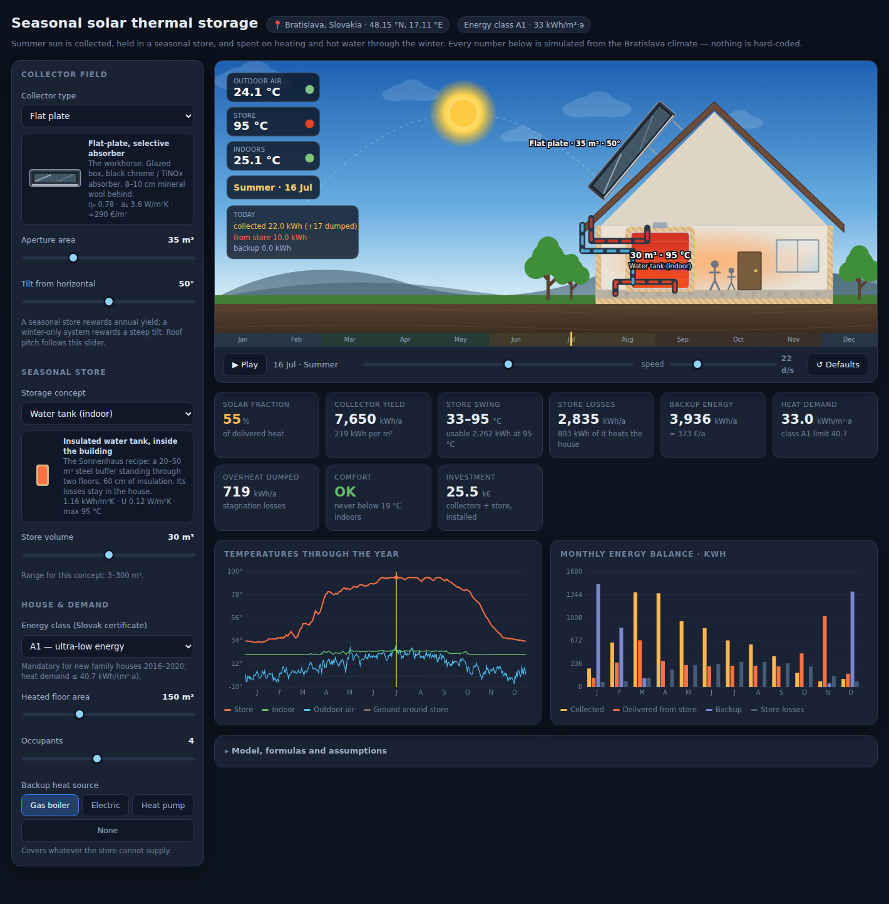

# Seasonal solar thermal storage — Bratislava

An interactive, self-contained HTML simulation of **summer solar heat stored until winter**
to heat a Slovak energy-class-A family house.

Open `index.html` in any browser. No build step, no dependencies, no network access.



## What it does

Pick a **collector type**, a **seasonal store** and a **house**, and watch a full year run:
the store charges from April, peaks in August, and is spent through the winter. The animation
shows the season, the outdoor air temperature, the store temperature and the indoor temperature,
with the fluid loops flowing only when heat is actually moving.

Everything on screen is computed at runtime from the Bratislava climate — no figure is hard-coded.

**Collectors** (each drawn as its own SVG): flat-plate, high-efficiency flat-plate, evacuated
tube, evacuated tube with CPC reflector, unglazed absorber mat, and PVT hybrid.

**Stores** (real concepts, each drawn in section at its true depth): insulated water tank inside
the building, buried water tank, water pit store with a floating lid, gravel–water pit store,
an insulated sand bed under the slab, a borehole field in rock, and a paraffin PCM store.
Collector area, tilt, store volume, floor area, occupancy and the backup source are all adjustable.

## Location and climate

Bratislava, 48.15 °N / 17.11 °E. A synthetic year is generated with correlated day-to-day
weather — runs of cloud, cold snaps, lying snow — and then every month is pinned back onto the
published 1991–2020 normals, so the year reproduces the real climate exactly:

| | J | F | M | A | M | J | J | A | S | O | N | D | year |
|---|---|---|---|---|---|---|---|---|---|---|---|---|---|
| mean air temp (°C) | 0.3 | 1.8 | 6.0 | 11.4 | 16.1 | 19.6 | 21.5 | 21.0 | 16.0 | 10.6 | 5.3 | 1.3 | **10.9** |
| horizontal irradiation (kWh/m²) | 27 | 45 | 87 | 130 | 162 | 170 | 178 | 155 | 108 | 67 | 31 | 22 | **1182** |

Solar geometry (declination, sunset hour angle, day length 8.1 h in December to 15.9 h in June)
is computed rather than tabulated. Daily irradiation is split into beam and diffuse with the
**Erbs** correlation and projected onto the collector plane with the **HDKR** anisotropic-sky
model, so tilt is a genuine parameter — the optimum comes out near 30–35°, worth about +8 %
over horizontal.

## Physics

| Part | Model |
|---|---|
| Collector | EN ISO 9806 curve `η = η₀ − a₁·ΔT/G − a₂·ΔT²/G`, minus 7 % for pipework, exchanger and pump; yield above the stagnation temperature is dumped |
| Store | Single well-mixed node, envelope `A = k·V^(2/3)` — the reason large stores win. Buried stores carry a warmed ground shell, so four consecutive years are run and the fourth is reported |
| House | Loss coefficient **solved** so the EN ISO 13790 monthly method returns exactly the demand of the selected certificate class |
| Delivery | Hot water first (direct above 56 °C, otherwise the store pre-heats the mains), then space heating on a 25–40 °C underfloor curve; the optional heat pump uses the store itself as its source |

The **energy class** follows Slovak vyhláška 364/2012 Z. z.: class A1 is a heat demand for
heating of ≤ 40.7 kWh/(m²·a), mandatory for new family houses 2016–2020; class A0 is the nearly
zero energy standard mandatory since 1 January 2021. Selecting a class sets the house's UA so
the simulated demand lands inside that band.

## Representative results

Default case — 35 m² flat-plate at 50°, 30 m³ indoor tank, 150 m² class-A1 house, four
occupants, gas backup:

- solar fraction **55 %**, collector yield 218 kWh/m²·a
- store swings **33 → 95 °C** over the year
- store losses 2 840 kWh/a, of which ~800 kWh usefully heats the house

Scaling to 60 m² and 100 m³ reaches 92 %; 80 m² with 200 m³ reaches 100 %. A borehole field
sized for one house loses everything it collects — which is exactly why BTES is a
community-scale technology.

## Tests

```
node test/model.test.mjs
```

85 checks run the physics model straight out of `index.html`: the synthetic year must reproduce
the Bratislava normals month by month, solar geometry must match the latitude, each energy class
must land inside its legal limit, better inputs must give better outputs, the store may never
exceed its maximum temperature or freeze, and the energy balance must close for every
collector/store combination.

## Caveats

Engineering estimates for exploring trade-offs, not a design document. Daily time steps with
four sub-steps, one store node, one house node. A real project needs hourly simulation
(TRNSYS, Polysun), a measured load profile and a ground survey.
